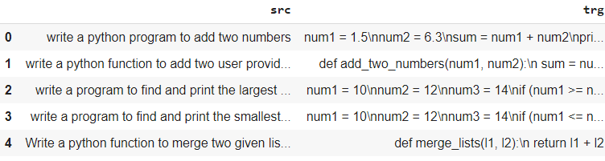

# Capstone Project

## Objective and Guidelines
The capstone project is to write a transformer-based model that can write python code (with proper whitespace indentations). Here are the key points:

1. The dataset can be found [here](https://drive.google.com/file/d/1rHb0FQ5z5ZpaY2HpyFGY6CeyDG0kTLoO/view?usp=sharing). The dataset has 4600+ examples of English text to Python code.
2. Write a transformer-based model that can learn to translate English to Python.
3. Must use transformers with self-attention, multi-head, and scaled-dot product attention in the model
4. There is no limit on the number of training epochs or total number of parameters in the model
5. Train a separate embedding layer for python keywords that pays special attention to whitespaces, colon and other things (like comma etc)
6. Your model has failed the capstone score if:
    * your model fails to do proper indentation
    * your model fails to use newline properly
    * your model has failed to understand how to use colon (:)
    * your model has failed to generate proper python code that can run on a Python interpreter and produce proper results
7. You need to take care of some preprocessing things like:
    * the dataset provided is divided into English and "python-code" pairs properly
    * the dataset does not have anomalies w.r.t. indentations (like a mixed-use of tabs and spaces, or use of either 4 or 3 spaces, it should be 4 spaces only). Either use tabs only or 4 spaces only, not both
    * the length of the "python-code" generated is not out of your model's capacity
8. You need to submit a detailed README file that:
    * describes the data clean required
    * your model architecture and salient features w.r.t. the model we wrote in the class
    * describes the loss function and how is it unique or improved than just using cross-entropy
    * your data preparation strategy
    * your data extension strategy (if you add more data)
    * your "python-code" embedding strategy
    * your evaluation metrics
    * 25 example output from your model
    * attention graph/images between text and "python-code"
    * any additional point you'd want to add

## Capstone Solution
Our objective is to generate python source code given a natural language query in English Language.

## About the Dataset

The dataset contains natural language queries and python code snippets pair manually annotated. The raw data contains around 4600 samples. The raw data can be downloaded from [here](https://github.com/anubhabPanda/END_Phase1/blob/main/Week14/Dataset/english_python_data.txt).

The raw data had the following issues:
  * In some cases the indentation was absent
  * There wasn't any space separating two samples

Few examples of raw data :

**Example 1**

    # write a python program to add two numbers 
    num1 = 1.5
    num2 = 6.3
    sum = num1 + num2
    print(f'Sum: {sum}')

**Example 2**

    # write a python program to add two numbers 
    num1 = 1.5
    num2 = 6.3
    sum = num1 + num2
    print(f'Sum: {sum}')

The raw data was manually cleaned to fix this issue. The cleaned dataset can be found [here](https://github.com/anubhabPanda/END_Phase1/blob/main/Week14/Dataset/english_python_data_corrected.txt)

## Data Preprocessing Steps
This step will convert the training examples in text file into a dataframe containing the natural language and source code in two columns. Steps taken :
  * The text file is read line by line and each line is stored in a list.
  * Iterating through the list we store the text between \n followed by #. 
  * The above steps will fail if comments are present in the text. Hence we take care of the comments by either removing them using regex or taking care in the data cleaning step.
  * Comments that are not preceded by a \n is retained
  * After converting to a dataframe, the natural language prompt are preceded by # and numbers. We remove # and numbers preceding the natural language queries. Space from the start and end of the text is also stripped.
  * We also remove data points where the length of the target source code text is greater than 250. We do this due to limited computational capacity. Also 80% of source code text is within 250 characters in length.
  * Number of data samples after cleaning and preprocessing = 3535

Data preprocessing is shown in the image below :

The final dataframe that will be used for modeling is shown below :

## Modeling Steps

We will tackle this problem step by step with incremental improvements in each step.

**Train-Validation-Test split used : 80-15-5** 

### Baseline
In the first experiment we will setup a baseline. In the subsequent steps we will to this baseline model to improve the performance. For baseline we will be using the following:

* Tokenization : We will use default spacy english language model.
* Hyperparameters: 
  * Batch Size: 64
  * Encoder Layers: 3
  * Decoder Layer: 3
  * Hidden Dim: 256
  * Encoder PF Dimension: 512
  * Decoder PF Dimension: 512
  * Loss Function : Cross Entropy
  * Optimizer : Adam
  * Learning Rate: 0.0001

